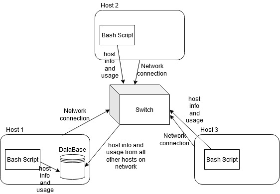

# Linux Cluster Monitoring Agent
This project is under development. Since this project follows the GitFlow, the final work will be merged to the master branch after Team Code Team.
## Introduction
This project implements a way to check which computers are in a cluster and their usage. The infrastructure team can used the psql_docker to make a container in which they can keep the RDBMS tables of information for the multiple computers and their usage. Creating the DDL will help in creating the tables needed in the docker container in which the team can use to store the information. The monitoring agent will help them in gathering the cluster information through the use of Linux commands in bash scripts. This monitoring agent is critical to the team as it will provide the information for the computers in the cluster and their usage periodically using crontab, and with this information it can input such collected information to the tables in the docker container. All the scripts, bash or sql will help the infrastructure team determine which computers/nodes are on the cluster and how they are using the resources.

## Architecture and Design
###1) Cluster Diagram

###2) Tables information

There are two tables that are used, host_info and host_usage. Both the tables collect data about the hosts on the clusters, but they collect different information, though there are some values that the host_usage table collects from the host_info table. Host_id in host_usage is the foreign key for the id primary key in host_info.

host_info collects the following information:

-id: its a serial number that can be used to identfy the host on both tables.
-hostname: get the system host name which will be set as unique value
-cpu_number: the number of cpu cores for the host
-cpu_archetecture: Get the archecture of the host
-cpu_model: Get the host cpu model to identify the cpu used by the host
-cpu_mhz: Get the host cpu clock rate
-L2_cache: Get the L2_cache of the host
-total_mem: Get the total memory of the host in KB size
-timestamp: Get the day and time in UTC for when all this  information  was collected for host_info table

host_usage collects the information about each host's usage at the time. Working together with crontab, it can collect the data every 5 mins and insert that data into the table. This table shows the usage change after each period.

-timestamp: Get the UTC day and time for when the host_usage information had been collected.
-host_id: Get the id from the host_info table for which this information is being collected for.
-memory_free: Current free memeory for the host in MB
-cpu_idle: Percentage of cpu that is currently idle
-cpu_kernal: Percentage of cpu kernel
-disk_io: the current number of I/O in disk
-disk_available: The amount of disk space that is currently available in MB

###3) Describe scripts

psql_docker.sh: create/start/stop docker container that will hold the tables
ddl.sql: create the host info and usage tables
host_info.sh: collect host info and insert them into the host_info table
host_usage.sh: collect usage info and insert them into the host_usage table
queries.sql: run the queries on host_info and host_usage tables. These queries are such as ranking L2 cache in desending order grouped by cpu number and host id. The other query will figure out the average memory use of each host every 5 minutes.

## Usage
1) how to init database and tables

to create a database, run the following commands:

--connect to the psql instance

`psql -h localhost -U postgres -W`

--list all database

`postgres=# \l`

--create a database

`postgres=# CREATE DATABASE host_agent;`

--connect to the new database;

`postgres=# \c host_agent;`

to create tables, run the following command with appriopate values where needed:

`psql -h localhost -U postgres -W -d host_agent -f sql/ddl.sql`

2) `host_info.sh` usage

run the command in bash : `./scripts/host_info.sh psql_host psql_port db_name psql_user psql_password`

3) `host_usage.sh` usage

runt the command in bash: `bash scripts/host_usage.sh psql_host psql_port db_name psql_user psql_password`

4) crontab setup

use the following steps:

--edit crontab jobs

`bash> crontab -e`

--add this to crontab

`* * * * * bash /home/centos/dev/jrvs/bootcamp/linux_sql/host_agent/scripts/host_usage.sh localhost 5432 host_agent postgres password > /tmp/host_usage.log`

## Improvements 
1) write the query to be able to swithc to host_agent in ddl.sql
2) write the query to be able to get host node failure information in queries.sql
3) write better sql queries

